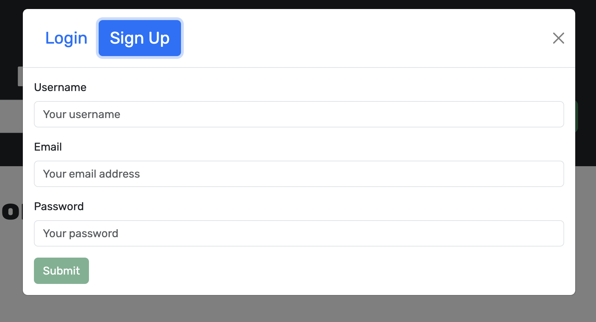

# Google-Books

  ## License
  
  [MIT License](https://opensource.org/licenses/MIT)

  ## Contents
  ---------
  - [License](#license)
  - [Description](#description)
  - [Installation](#installation)
  - [Usage](#usage)
  - [Contribution](#contribution)
  - [Tests](#tests)
  - [Questions](#questions)

  ## Description
  This program allows you to use a Google Books API search engine to search for books and save them for later reference. This program uses GraphQL and an Apollo Sevrer. It was built with a MERN stack set-up in mind. Starter code was used and then filled out for authentication and converting a Restful API to a graphQL apollo server set-up.

  ## Installation

  After doing a clone of the repo open a terminal window for this application and type:

  `` git clone git@github.com:bjaegerthomas/Google-Books.git ``

  You will want to do a few things.
  
  First you will need to set-up your own local MongoDB database using Compass or a remote one using Atlas. Next you will need to copy the database address into your own env file along with a secret password key for JWT authentication:

  

  Next run the following commands:

  `` npm run render-build `` and then
  `` npm run start ``

  ## Usage
  Here are a few screenshots:

  
  
  

  ## Contribution
  After cloning the repository be sure to create a new branch for your feature or fix.
  Make your changes and commit them with descriptive messages.
  Submit a Pull Request with clear explanations of your modifications.
  Use meaningful variable names and comments.
  Follow guidelines for GraphQL, React, Typescript, and MongoDB code formatting.

  ## Tests
  You can see a working version of the application deployed on Render here:

  https://google-books-7esn.onrender.com

  ## Questions
  - GitHub: [bjaegerthomas](https://github.com/bjaegerthomas)
  - Email: bjaegerthomas@gmail.com